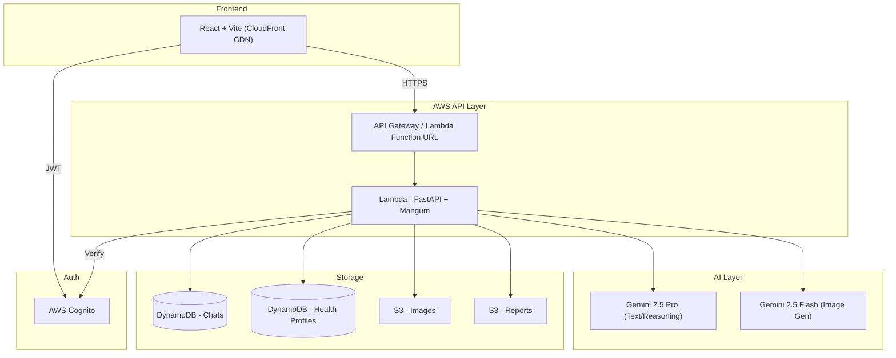

# MediBot - AI Medical Assistant Chatbot


A modern, AI-powered medical assistant chatbot with multimodal capabilities, step-by-step visual guides, and secure health profile management.

## ✨ Features

- 🤖 **Google Gemini 2.5 Pro** for accurate medical advice & reasoning
- ⚡ **Intelligent Model Routing** - Simple queries use **Gemini 2.0 Flash** for speed & cost efficiency
- 🖼️ **Gemini 2.5 Flash Image** for Step-by-Step Visual Guides (4-Panel Grid Layout)
- 🌍 **Multi-language Support** - Full UI & Chat in English, Telugu, Hindi, and Spanish
- 📄 **Export as PDF** - Download complete conversation history with images for offline reference
- 📎 **Large File Analysis** - Upload PDFs/Images (up to 50MB) via S3 for AI analysis
- 🔐 **Secure Authentication** - AWS Cognito (Sign up, Sign in, Password Reset)
- 💾 **Persisted History** - Chats are saved to DynamoDB and can be reloaded
- 🏥 **Health Profile** - Stores conditions, medications, and allergies for personalized context
- 🛡️ **Safety Filters** - Input/output safety checks with fallback responses
- 🧩 **Resilient Visuals** - Step image fallbacks + S3 URL regeneration for history
- ⚡ **High Performance** - CloudFront caching + Lambda Function URLs for speed
- 👤 **Guest Mode** - Public access with a 3-message trial limit (no login required)
- 📱 **Responsive Design** - Mobile-first UI built with React & Vanilla CSS

---

## 🚀 Live Demo

**Frontend**: [https://d17eixu2k5iihu.cloudfront.net](https://d17eixu2k5iihu.cloudfront.net)

_(Sign up to create your own secure account)_

---

## 🏗️ Architecture

The application follows a **Serverless Event-Driven Architecture**:



1.  **Frontend (React + Vite)**: Hosted on S3, served via **CloudFront CDN**.
2.  **API Gateway & Lambda**: REST API. Heavy tasks use **Lambda Function URLs** to bypass 29s timeout.
3.  **AI Layer**: **Model Router** directs simple queries to `gemini-2.0-flash` (fast/cheap) and complex queries to `gemini-2.5-pro` (reasoning). Image generation uses `gemini-2.5-flash`.
4.  **Storage**: DynamoDB (chats, profiles), S3 (images via CloudFront OAC, encrypted reports).
5.  **Authentication**: **AWS Cognito** with JWT validation.

---

## 📚 API Documentation

When running locally, interactive API docs are available at:
- **Swagger UI**: [http://localhost:8000/docs](http://localhost:8000/docs)
- **ReDoc**: [http://localhost:8000/redoc](http://localhost:8000/redoc)

---

## 🛠️ Tech Stack

| Component | Technology |
|:---|:---|
| **Frontend** | React 18, Vite, TypeScript, Vanilla CSS |
| **Backend** | FastAPI, Python 3.11, Mangum, Pydantic |
| **AI/LLM** | Google Gemini 2.5 Pro (Reasoning), Gemini 2.5 Flash (Images) |
| **Auth** | AWS Cognito + Amplify UI |
| **Database** | AWS DynamoDB (Single Table Design concepts) |
| **Storage** | AWS S3 (Reports, Images, Assets) |
| **Hosting** | AWS CloudFront (CDN) + Lambda (Serverless) |
| **IaC** | AWS SAM (Serverless Application Model) |

---

## 📁 Project Structure

```
├── backend/                 # Python FastAPI (Lambda)
│   ├── api_server.py       # App entry point & router wiring
│   ├── routes/             # Route modules
│   │   ├── chat.py         # /chat, /generate-image
│   │   ├── auth_routes.py  # /auth/*, /guest/*
│   │   ├── history.py      # /history
│   │   ├── profile.py      # /profile, /analyze-report
│   │   └── upload.py       # /upload-report, /upload/presigned-url
│   ├── models/             # Pydantic request/response models
│   ├── dependencies.py     # FastAPI Depends (auth, client info)
│   ├── gemini_client.py    # Gemini AI & Image generation
│   ├── auth.py             # Cognito JWT verification
│   ├── health_profile.py   # RAG for user health data
│   ├── report_analyzer.py  # Multimodal file analysis
│   └── chat_history.py     # DynamoDB operations
│
├── frontend/               # React + Vite
│   ├── src/
│   │   ├── components/    # ChatInterface, StepCard, Layout
│   │   ├── pages/         # History, Profile, Upload
│   │   ├── hooks/         # Custom hooks (useChatState)
│   │   ├── api/           # Typed API client
│   │   └── types/         # Shared TypeScript interfaces
│   └── public/            # Static assets
│
├── infrastructure/         # AWS SAM
│   └── template.yaml      # CloudFormation template
│
├── deploy.sh               # Automated deployment script
├── CONTRIBUTING.md         # Contribution guidelines
└── README.md
```

---

## 💻 Local Development

### Prerequisites
- Node.js 18+
- Python 3.11 (required for SAM build/runtime)
- AWS CLI configured
- SAM CLI installed

### Backend
```bash
cd backend
python3.11 -m venv .venv
source .venv/bin/activate
pip install -r requirements.txt
uvicorn api_server:app --reload --port 8000
```

### Frontend
```bash
cd frontend
npm install
npm run dev
```

### Environment Variables
Create `.env` in the root:
```env
GOOGLE_API_KEY=your_gemini_api_key
```

For local frontend auth, create `frontend/.env`:
```env
VITE_API_URL=http://localhost:8000
VITE_COGNITO_USER_POOL_ID=your_pool_id
VITE_COGNITO_CLIENT_ID=your_client_id
```

---

## ☁️ Deployment

We use a unified deployment script that handles:
1. Backend Build (SAM)
2. Stack Deployment (CloudFormation)
3. Frontend Build (Vite)
4. S3 Upload & CloudFront Invalidation

```bash
# Deploy to Production (default)
export GOOGLE_API_KEY="your_key"
./deploy.sh

# Deploy to Staging
./deploy.sh staging
```

Notes:
- `sam build` requires Python 3.11 on your PATH.
- Integration tests in `backend/tests/test_all_features.py` require live AWS access (see Testing).

---

## ✅ Testing

### Backend
```bash
cd backend
source .venv/bin/activate
pytest -q
```

Run live integration tests:
```bash
RUN_INTEGRATION_TESTS=1 pytest tests/test_all_features.py -q
```

### Frontend
```bash
cd frontend
npm run test:run
```

---

## 🔒 Security

- **HTTPS Everywhere**: TLS 1.3 via CloudFront & API Gateway.
- **Data Encryption**: S3 buckets and DynamoDB tables encrypted at rest (AES-256).
- **Authentication**: JWT validation for all personalized endpoints.
- **Presigned URLs**: Secure, time-limited access for file uploads.
- **CloudFront OAC**: Images bucket secured via Origin Access Control (no public S3 access).
- **Dependency Scanning**: `pip-audit` runs in CI to catch known vulnerabilities.

---

## 🤝 Contributing

See [CONTRIBUTING.md](CONTRIBUTING.md) for development guidelines.

---

## 📄 License

MIT License
